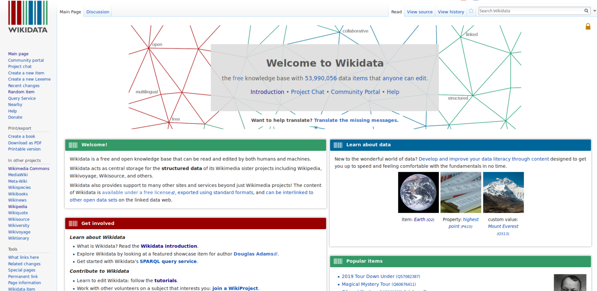

::::::::::::::::::::::::::::::::::::::: objectives

- Feel comfortable describing Wikidata to colleagues.
- Learn about Wikimedia projects (e.g. Wikipedia, WikiCommons) and how Wikidata is related to them.
- Know why linked open data is important to librarians.
- Be able to identify components of a Wikidata item page, how Wikidata is organized and how to navigate a Wikidata item.

::::::::::::::::::::::::::::::::::::::::::::::::::

:::::::::::::::::::::::::::::::::::::::: questions

- What is Wikidata?
- How does the Wikidata interface look?
- How is Wikidata linked to other Wiki projects?
- What are Items and Statements?

::::::::::::::::::::::::::::::::::::::::::::::::::

## What is Wikidata?

Wikidata [describes itself](https://www.wikidata.org/wiki/Wikidata:Main_Page) as "a free and open knowledge base that can be read and edited by both humans and machines." 

Most users will be familiar with [Wikipedia](https://en.wikipedia.org/wiki/Wikipedia:Introduction), the "free encyclopedia, written collaboratively by the people who use it. It is a special type of website designed to make collaboration easy, called a wiki. Many people are constantly improving Wikipedia, making thousands of changes per hour. All of these changes are recorded in article histories and recent changes."

Wikidata uses the same speed and similar collaborative editing platform, but for data. Wikidata functions as the central database for a variety of Wiki projects, including Wikipedia, Wiktionary, and Wikisource, among others.

Wikidata contains various data types (e.g. text, images, quantities, coordinates, geographic shapes, dates). The data can be viewed in a web browser, but it can also be queried via a query interface called SPARQL, which we will cover later in this lesson. Data on Wikidata is published under the Creative Commons Public Domain 1.0 license. Thus, the data can be modified, copied, and distributed without permission.

Wikidata also contains authority files, bibliographic data, and other content that can similarly be found or managed in library databases.

Importantly, Wikidata can be understood as linked open data, which can be  [connected](https://www.wikidata.org/wiki/Wikidata:Data_access#How_can_I_get_data_out_of_Wikidata?) to other open data sets on the web.

## Motivation and "Why should I use Wikidata"

Wikidata has many features that make it of interest to librarians and knowledge management, including:

1. **Knowledge Integration and Access:** Wikidata offers an open and structured way to interlink various identifiers (like ORCID, GND, or VIAF). This is essential for librarians who manage resources and need to ensure that different systems and databases can communicate with each other seamlessly.

2. **Authority Control:** Librarians often work with authority files like GND or VIAF to ensure consistent naming conventions. Wikidata helps to map and retrieve these identifiers, making cataloging more efficient.

3. **Global and Collaborative Nature:** Wikidata is a collaborative platform where librarians can contribute and maintain data, ensuring that their records stay relevant and up to date within a global information network.

4. **Real-World Examples:**
  a. *Scholia*: A tool built on top of Wikidata that visualizes scholarly profiles and research outputs, showing the impact of Wikidata in academic and research contexts. Librarians can showcase Scholia as a tangible example of how data in Wikidata is used for research and scholarship.
  b. *Crosswalks between systems*: Wikidata’s ability to link various identifiers (e.g., connecting ORCID to GND or VIAF) is beneficial for cross-referencing and data cleaning in library management systems.

## 1\.1 Wikidata interface

This section of the lesson introduces the Wikidata interface as it can be seen in a web browser.
Let's learn about some of the important elements of how you can read
and interact with the data on Wikidata.

- Start by going to the [Wikidata Main Page](https://www.wikidata.org/wiki/Wikidata:Main_Page) by typing "www.wikidata.org" into your browser. You will see something like this:
  
  {alt='Screenshot of the Wikidata main page displaying in a web browser'}  
  *Screenshot of [Wikidata Main Page](https://www.wikidata.org/wiki/Wikidata:Main_Page)*

## 1\.2 Wikidata Items and Item Pages

The primary unit of data described on Wikidata are "items." Each item has an item page with a unique identifier designated by the letter `Q` followed by a string of numbers. Let's explore a Wikidata item page, which will also demonstrate the characteristics of items in Wikidata.

### Explore a Wikidata Item page
  
- Click in the search bar in the top right corner of the main page and enter "british library". As you start typing, you will see a list with search results. Click the entry that says: "British Library (Q23308) national library of the United Kingdom". Now you should see the british library's item page: 
[https://www.wikidata.org/wiki/Q23308](https://www.wikidata.org/wiki/Q23308)
  
- Let us explore the item *British Library (Q23308)*. The top part of the item page identifies the item. Here you will see:
    
  - label
  - description
  - unique identifier (constructed as the capital letter followed by one or more numbers)
  - aliases
  
- Farther down on the page is a *Statements* subheading. This section shows relationships, or claims, that have been asserted about the item. Statement may include:
    
  - property (constructed as the capital letter P followed by one or more numbers)
  - value
  - qualifier (optional)
  - references (optional)
  - As you can see, a property can have multiple values. For example, *member of* indicates multiple values. These values can be further specified or supported by qualifiers (not shown on the item page for British Library)
  - statements can also be called "triples," since they include three parts (the item, the property relationship, and the property's value), which we will look into more closely later on.
 
Wikidata items, as you can see above, have many special parts, like statements, qualifiers, and so on. The following diagram uses a different Wikidata item — [Douglas Adams (Q42)]((https://upload.wikimedia.org/wikipedia/commons/a/ae/Datamodel_in_Wikidata.svg)) — to illustrate the various elements of a Wikidata item and shows how they may appear on an item page. This is the official Wikidata example item and is widely used in Wikidata documentation:

{alt='Labeled display of a Wikidata item showing how elements like identifier, description, and staements may be displayed'}

:::::::::::: callout

### Wikidata editing and change history

Most pages can be edited by anyone (note, however, that the British Library - Q23308 item is semi-protected), and like other wiki projects, Wikidata tracks all changes made to an item.
To see the changes made to an item, click "View history".
To edit an item, click the pen icon followed by the word "edit" in the upper-right area of an item page.
Don't worry if you made a mistake, you can always go back in an item's history and restore or undo changes.
We will explore the steps of editing a Wikidata item in [episode 3, "Introduction to editing"](../episodes/03-intro_to_editing.html).

::::::::::::

## 1\.3 Wikidata's commitment to open data 

All of Wikidata's data is published freely and openly online under a [Creative Commons CC0 License](https://creativecommons.org/publicdomain/zero/1.0/), which states:
"The person who associated a work with this deed has dedicated the work to the public domain by waiving all of his or her rights to the work worldwide under copyright law, including all related and neighboring rights, to the extent allowed by law. You can copy, modify, distribute and perform the work, even for commercial purposes, all without asking permission." 
In other words, the data is openly licensed and reusable. Since Wikidata can also be linked to other data sources on the web, this means Wikidata is *linked open data*.

- Follow this link to view a pdf that offers a one-page overview of Wikidata (visual): [https://commons.wikimedia.org/wiki/File:Wikidata-in-brief-1.0.pdf](https://commons.wikimedia.org/wiki/File:Wikidata-in-brief-1.0.pdf)

:::::::::::: challenge

### Explore a Wikidata Item

Locate the Wikidata page of the city or country you were born in. Look for the population. 

- Has the population changed over time? Some wikidata pages appear in multiple languages. 
- Are the aliases and data similar between Wikidata and the various Wikipedia entries in different languages? 
- Compare the information in Wikipedia and Wikidata

:::::::: solution

- Depending on the detail and amount of information about a place, there may be multiple values regarding a city's population. Because a city or country changes over time, Wikidata statements can be qualified, including with the addition of a start/end date, or by providing a citation for the data. The change in population over time provides a good example of the importance of providing qualifications for Wikidata staements.

::::::::

::::::::::::

## 1\.4 Wikidata Item Eastereggs

While most of the Q identifiers are arbitrary numbers, there are a few that suggest some meaning or humor, such as:

- [Q1 - Universe](https://www.wikidata.org/wiki/Q1)
- [Q2 - Earth](https://www.wikidata.org/wiki/Q2)
- [Q3 - Life](https://www.wikidata.org/wiki/Q3)
- [Q4 - Death](https://www.wikidata.org/wiki/Q4)
- [Q5 - Human](https://www.wikidata.org/wiki/Q5)
- [Q13 - Fear of the number 13](https://www.wikidata.org/wiki/Q13)
- [Q24 - Jack Bauer](https://www.wikidata.org/wiki/Q24)
- [Q42 - Douglas Adams (The Hitchhiker's Guide to the Galaxy)](https://www.wikidata.org/wiki/Q42)
- [Q404 - HTTP 404](https://www.wikidata.org/wiki/Q404)
- [Q666 - Number of the beast](https://www.wikidata.org/wiki/Q666)
- [Q12345 - Count von Count, Character on Sesame Street](https://www.wikidata.org/wiki/Q12345)

## 1\.5 Linking Wikidata to other Wiki resources

One of the most important and powerful aspects of Wikidata item pages is the final subheading, *Identifiers*. This is a special section that appears at the end of a Wikidata item page, and it is where information about how an item is identified in other databases or knowledge bases. Here, for example, is where you will find information about how an author's Wikidata page relates to various national library catalogs, the Virtual International Authority File, or fan databases that document an author's writings. This linking feature, which is quite highly developed in Wikipedia, makes the data especially valuable to libraries, archives, and other cultural heritage information.

As well as linking to external identifiers and authority sources, this section also has information about links to an item's Wikipedia page (if there is one), as well as other WikiMedia projects, including WikiCommons, WikiSource, and others. 

:::::::::::: challenge 

### Links from Wikipedia to Wikidata

Let's take a look at the relationships between Wikipedia and Wikidata. For example, how about Darwin's [On the Origin of Species](https://en.wikipedia.org/wiki/On_the_Origin_of_Species), a notable scientific work that is discussed in both resources.

- What information is common between both resources? How would you describe the information in Wikidata, in comparison to that in Wikipedia? How are they similar or different?

:::::::: solution 

  - \=> Follow the link "Wikidata item" on the left side under "tools"
  - \=> [https://www.wikidata.org/wiki/Q20124](https://www.wikidata.org/wiki/Q20124)
  - \=> the Wikipedia article is linked on the Wikidata's item page. You can find it on the right side.
  - \=> link to WikiCommons and WikiSource

It is important to note that Wikidata is limited to basic statements or assertions, such as when the work was published, who and where it was published, and who wrote the work. This is similar to a catalog record. The Wikipedia article, on the other hand, discusses the themes and structure, the impact and reception of the work, and subsequent or ongoing debates.

::::::::

::::::::::::

:::::::::::::::::::::::::::::::::::::::: keypoints

- Wikidata entities are known as Items, and each item is displayed on a page that is identified with the item's "Q" number
- Statements are assertions about items, which state relationships between items using wikidata properties.
- Relationships between entities are known as Properties, and each property is identified with a "P" number
- Statements are also known as "triples"
- Wikidata and Wikipedia are complementary, but Wikidata is focused on basic claims or assertions, not descriptive or narrative information

::::::::::::::::::::::::::::::::::::::::::::::::::
