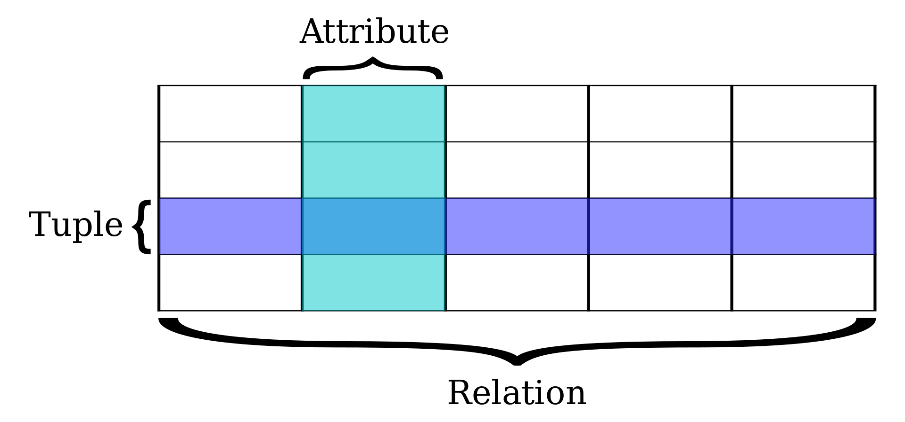
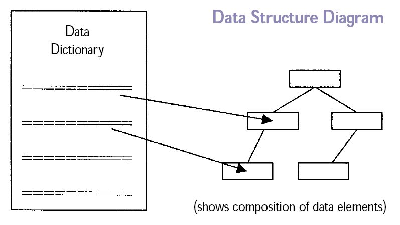
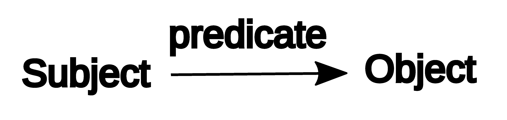
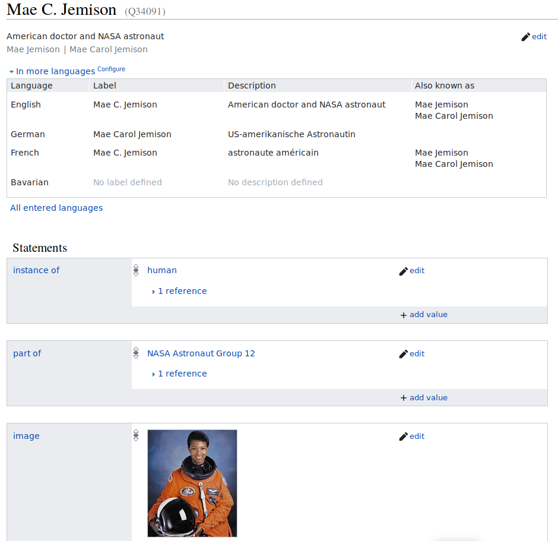

::::::::::::::::::::::::::::::::::::::: objectives

- Know what a triple is, and relate structure of a Wikidata statement to traditional metadata field structure
- Know how linked data can create more context for patrons/users in library catalogs
- Know how linked data can improve recall in library catalogs? 

::::::::::::::::::::::::::::::::::::::::::::::::::

:::::::::::::::::::::::::::::::::::::::: questions

- What is a RDF triple?
- What are the underlying components of RDF?

::::::::::::::::::::::::::::::::::::::::::::::::::

## 2\.1 Conceptual foundations: ways of storing data

There are many types of database structures and systems.
Two common database types are relational databases and graph databases.
Understanding the commonalities and differencews between these structures
helps to explain the uniqueness of Wikidata's data structure.

### 2\.1.1 Relational databases

A relational database is a set of formally described related tables from which data can be accessed or reassembled. This model organizes data into one or more tables (or "relations") of columns and rows, with a unique key identifying each row. each table/relation represents one "entity type" and these entities are connected via constrained relationships. This model is fully structured and mostly uses SQL (Structured Query Language) to retrive and manuplate data.  

A single database table and its basic parts is demonstrated below.
Note that each row is a set of ordered values that corresponds to a single data element.
Each column in the table may be understood as an attribute, which is a common attribute,
but for which each row has the data corresponding to that record.
Together, the entire table consitutes a data element that can be related
to other other tables.

{alt='Schematic of a data table in a relational database, which can be understood as a series of records (ordered tuple values) with various attributes, which can be related to other tables in the database through structured queries.'}

### 2\.1.2 Graph / Semantic databases

Semantic web is an extension of the World Wide Web standards, which promote common
formats and exchange protocols on the Web. For data exchange, the fundamental Web standard
is the Resource Description Framework, or RDF. Rather than being defined by tables,
this "graph" or semantic structure is defined by relationship statements. RDF outlines
a protocol for encoding and transmitting graph data on the web.  

RDF can be queried and analyzes using a language called SPARQL (Simple Protocol
and RDF Query Language). This has its own syntax, but it is similar to how relational
databases use SQL (Structured Query Language) to create and build queries.
In SQL relational database terms, RDF data can also be processed as a table,
but with only three columns – the subject column, the predicate column, and the object column.

{alt='A data structure diagram illustrating a possible connection between a list of triples, represented by a data dictionary, and a graph diagram which visualizes the relationships stipulated by the triples.'}

## 2\.2 Conceptual foundations: RDF and Triples

The RDF defines a conceptual data model that is based on the idea of
making statements about resources. Unlike a relational database,
the data model defined by RDF is text-focused, and it is based on relating defined entities
(as Wikidata calls them, *items*) that can be referred to by a Internationalized 
Resource Identifier (an IRI, which is nearly synonymous with a URL), and which can be
connected or related to any other defined entity through a standard language. While the data
structures can be complex, they rely on a basic structure called a **triple**,
which consists of a *subject* and an *object*, which are linked together, or related, by a defined 
relationship called a *predicate* (as Wikidata calls it, a *property*).
Here youcan read Wikipedia's definition of a [semantic triple](https://en.wikipedia.org/wiki/Semantic_triple).

{alt='Schematic illustration of an RDF Triple'}

The basic data statement is expressed in the form *subject–predicate–object*, also known as a *triple*.
The *subject* denotes the resource. In Wikidata, each item, or Q node, is a triple subject.
The *object* is usually another data entity, though it may also be a standalone value, which is related to the subject by the predicate relator.
The *predicate* denotes traits or aspects of the resource,
and expresses a relationship between the subject and the object, for example:

- The British Library *is-a* library
- John *is-a* person 
- John *born-in *1980
- John *has-occupation* engineer

Each of the above is a triple about the subject "John," wither different predicates
and objects.

As you can imagine, Wikidata has a huge number of data items (subjects), and 
it includes millions and millions of triple statements. 
RDF data are stores are also known as triplestores.

## 2\.3 Wikidata concepts

**Items**
: Items represents things and conceps, including people, places, events, subjects, and more. Examples mentioned previously include the British Library or Douglas Adams. Wikidata items have identifiers that start with letter "Q", like `Q42` for Douglas Adams.  
  Each item must have a label in one or more languages, optionally have alternative names and descrition.

**Properties**
: Properties represents attributes of the subject such occupation and have identifiers that starts with letter "P" like: P106 for Occupation.

**Claims**  
: Claims are the triple statements, which combine the formation of Item and Property and value.
For example: `Douglas Adams (Q42) - occupation (P106) - comedian (Q245068)`. *Note:* value can be already stored in wikidata, therefore the bot assigns the Q number of the value instead.

**Statement**  
: A Claim is a part of a statement, a statement also includes: References, Ranks, and Qualifiers.

**References**
: Used to store the source of the claim, using properties, such stated in, qoute, and etc.

**Ranks**  
: A useful component to deprecate outdated claims.

**Qualifiers**
: Qualifiers are basically properties but on claims rather than items.

:::::::::::::::::::::::::::::::::::::::  discussion

### Can you identify triple structures in library data?

Is data stored in the RDF triple format part of your work as a librarian?
Take some time to think about if data stored in the RDF triple format
is part of your work as a librarian.
Can you give an example in the format of an RDF triple?

:::::::::::::::::::::::::

:::::::::::::::::::::::::::::::::::::::  challenge

## Point out one RDF triple on the Wikidata item page of former astronaut Mae Jemison.

Got to the Wikidata page of Mae Jemison and point out one RDF triple.
An RDF triple consists of a subject, a predicate and an object.
Can you assign the three corresponding Wikidata terms?

:::::::::::::::  solution

## Solution

Go to Wikidata and either search for "Mae Jemison" or enter the ID *Q34091*.
In the picture below the statement "Mae C. Jemison - part of - NASA Astronaut Group 12" is an RDF triple.
{alt='Wikidata\_Main\_Page'}  
*Screenshot of [Wikidata Main Page](https://www.wikidata.org/wiki/Q34091)*

:::::::::::::::::::::::::

::::::::::::::::::::::::::::::::::::::::::::::::::

:::::::::::::::::::::::::::::::::::::::: keypoints

- Triples are the basic data structure of graph databases, and they are the conceptual structure of Wikidata statements.
- Wikidata items are denoted by a human-readable label and a short description, and a unique identifer that begins with a Q. These items are the subjects of linked Wikidata statements.
- Wikidata defines relationships between items, also known as triple *predicates*, with Wikidata *properties*.
- Wikidata statements can capture library information, such as relationships like creatorship, publication, aboutness, and more.

::::::::::::::::::::::::::::::::::::::::::::::::::

