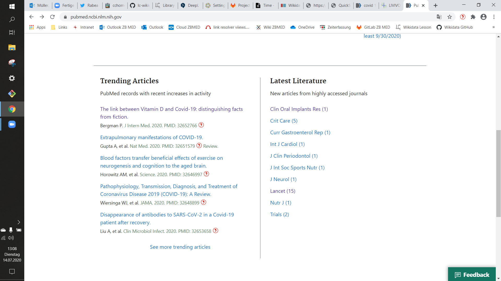
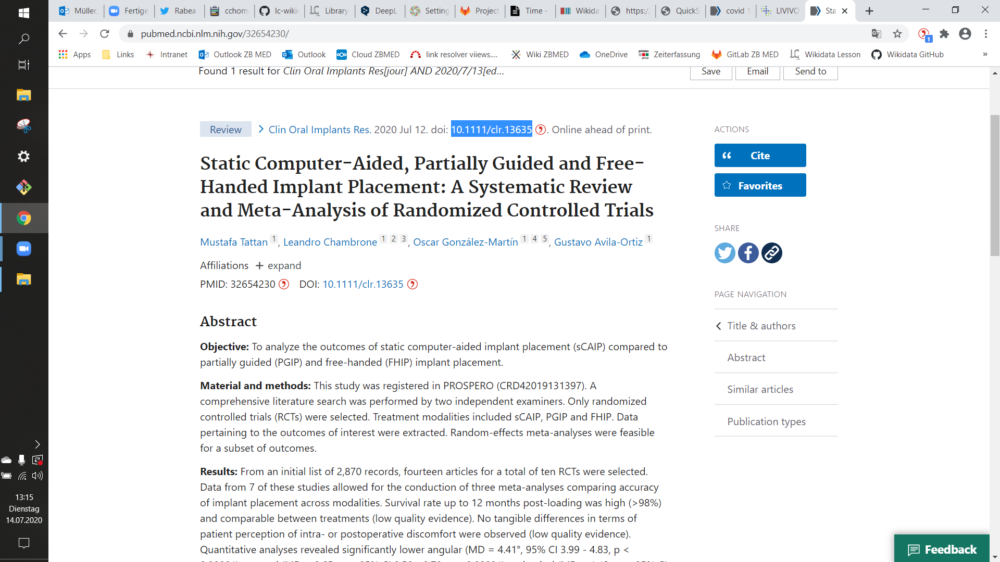
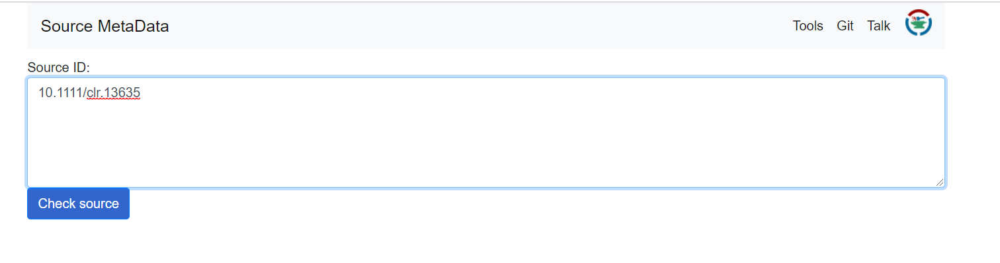
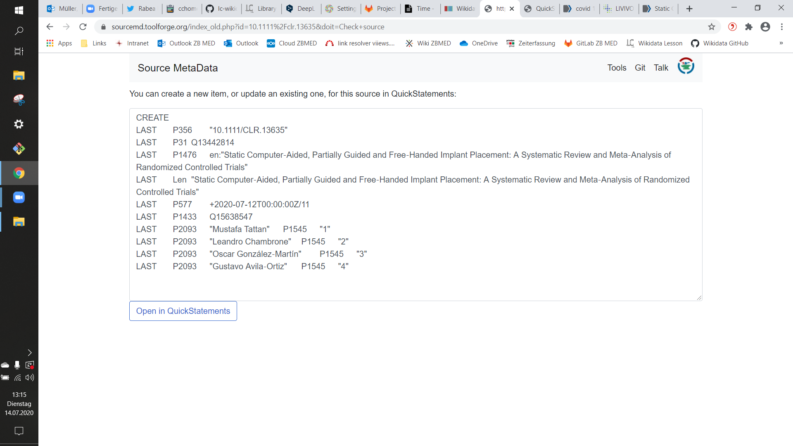
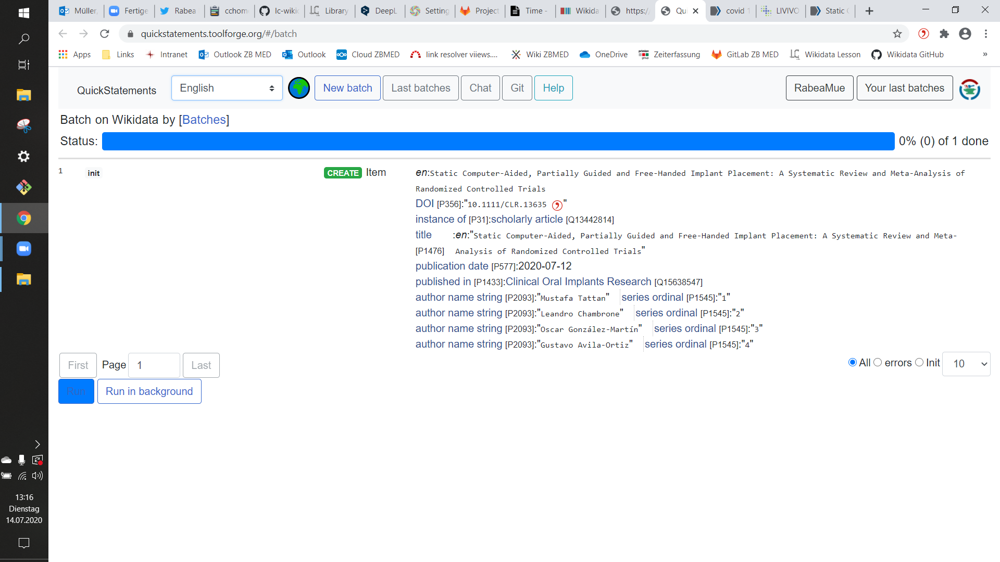

::::::::::::::::::::::::::::::::::::::: objectives

- Be familiar with some tools for editing, e.g. TABernacle, Wikidata Games, QuickStatements, Source MetaData or Author Disambiguator/Author resolver.

::::::::::::::::::::::::::::::::::::::::::::::::::

:::::::::::::::::::::::::::::::::::::::: questions

- How to automatically add statements with sourcemd and quickstatements?

::::::::::::::::::::::::::::::::::::::::::::::::::

## 4\.1 Disclaimer

The tools are under heavy development and due to that they might change or don't work as expected. If that happens just move on to the next episode.

## 4\.2 Introduction

So now we will work in the productive version. We will use DOI to automatically put an article into Wikidata via sourcemd. If you are familiar in Life Science you can use our example with PubMed for finding DOIs of new article, optional you can choose an journal related to your scientific field.
Sourcemd gets it metadata from [Crossref](https://de.wikipedia.org/wiki/Crossref), also look to [sourcemd:instructions](https://www.wikidata.org/wiki/Wikidata:SourceMD/instructions)

Potential open access journal:

- [PLOS One](https://plos.org/)
- [Beilstein Journal of Organic Chemistry (BJOC)](https://www.beilstein-journals.org/bjoc/articles/16/138)

## 4\.3 Adding statements via sourcemd and quickstatements

Go to [pubmed](https://pubmed.ncbi.nlm.nih.gov/), scroll down to "latest literature" and select an article:
{alt='latest\_articles'}

Save the DOI, PMID or PMCID of the article:

{alt='choose\_doi'}

Go to [sourcemd](https://sourcemd.toolforge.org/index_old.php) and paste the DOI or PMID into the search field:

{alt='paste\_into\_sourcemd'}

Click on "check source". Now you can see automatically generated statements including meta data of the article like author names or date of publication. Click on "Open in QuickStatements".

{alt='open quickstatements'}

A new window with QuickStatements will pop up. Now you'll get an overview of the new item and its statements. Confirm the changes by hitting the the "run" button:

{alt='run\_editing'}

## 4\.4 (OPTIONAL) Converting "author strings" to "author"

When bibliographic data is imported into Wikidata in bulk, author names 
are often stored as plain text strings using the property 
**author name string (P2093)** rather than as linked Wikidata items 
using **author (P50)**. Converting these strings to proper linked author 
items makes the data much more useful — for example, it enables tools 
like Scholia to generate complete researcher profiles.

### Finding author strings

You can find author strings that need disambiguation using this query 
collection maintained by the Foerstner Lab:

[Find Author Strings](https://github.com/foerstner-lab/Publication_list/blob/master/Query_Strings_for_Wikidata.md)

You can also access your own Scholia profile's curation page by appending 
`/missing` to your Scholia author URL, e.g.:
`https://scholia.toolforge.org/author/Q18921408/missing`

### Using the Author Disambiguator

The [Author Disambiguator](https://author-disambiguator.toolforge.org/) 
is a tool that helps you convert author name strings (P2093) to linked 
author items (P50). To use it:

1. Go to [https://author-disambiguator.toolforge.org/](https://author-disambiguator.toolforge.org/) 
   and log in with your Wikimedia account.
2. Enter an author name in the search field. Use natural order 
   (Given name Family name).
3. The tool will display a list of publications in Wikidata that have 
   this name as an author string.
4. Check the publications that belong to this author.
5. Select the corresponding Wikidata author item from the list of 
   potential matches at the bottom, or create a new one if needed.
6. Click "Link selected works to author" to replace the string with 
   a proper linked item.

::::::::::::::::::::::::::::::::::::::::: instructor

This exercise works best with authors who have many publications already 
in Wikidata, such as researchers active in open science or life sciences 
communities. Encourage learners to try their own name or the name of a 
colleague.

:::::::::::::::::::::::::::::::::::::::::::::::::::::

:::::::::::::::::::::::::::::::::::::::: keypoints

- Sourcemd and QuickStatements allow you to automatically add 
  bibliographic metadata from DOIs or PMIDs to Wikidata.
- The Author Disambiguator tool can help convert unstructured 
  author strings to linked Wikidata items.
- Tools for advanced editing are under active development and 
  may change or be temporarily unavailable.

::::::::::::::::::::::::::::::::::::::::::::::::::

