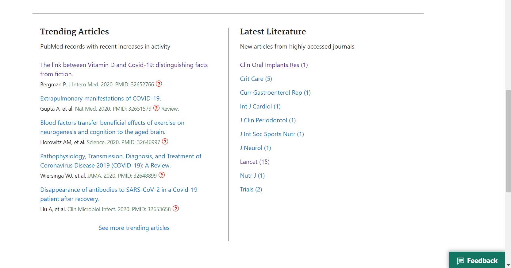

::::::::::::::::::::::::::::::::::::::: objectives

- Be familiar with some tools for editing, e.g. TABernacle, Wikidata Games, QuickStatements, Source MetaData or Author Disambiguator/Author resolver.

::::::::::::::::::::::::::::::::::::::::::::::::::

:::::::::::::::::::::::::::::::::::::::: questions

- How to automatically add statements with sourcemd and quickstatements?

::::::::::::::::::::::::::::::::::::::::::::::::::

## 4\.1 Disclaimer

The tools are under heavy development and due to that they might change or don't work as expected. If that happens just move on to the next episode.

## 4\.2 Introduction

So now we will work in the productive version. We will use DOI to automatically put an article into Wikidata via sourcemd. If you are familiar in Life Science you can use our example with PubMed for finding DOIs of new article, optional you can choose an journal related to your scientific field.
Sourcemd gets it metadata from [Crossref](https://de.wikipedia.org/wiki/Crossref), also look to [sourcemd:instructions](https://www.wikidata.org/wiki/Wikidata:SourceMD/instructions)

Potential open access journal:

- [PLOS One](https://plos.org/)
- [Beilstein Journal of Organic Chemistry (BJOC)](https://www.beilstein-journals.org/bjoc/articles/16/138)

## 4\.3 Adding statements via sourcemd and quickstatements

Go to [pubmed](https://pubmed.ncbi.nlm.nih.gov/), scroll down to "latest literature" and select an article:
{alt='latest\_articles'}

Save the DOI, PMID or PMCID of the article:

{alt='choose\_doi'}

Go to [sourcemd](https://sourcemd.toolforge.org/index_old.php) and paste the DOI or PMID into the search field:

{alt='paste\_into\_sourcemd'}

Click on "check source". Now you can see automatically generated statements including meta data of the article like author names or date of publication. Click on "Open in QuickStatements".

{alt='open quickstatements'}

A new window with QuickStatements will pop up. Now you'll get an overview of the new item and its statements. Confirm the changes by hitting the the "run" button:

{alt='run\_editing'}

## 4\.4 (OPTIONAL) Converting "author strings" to "author"

[Find Author Strings](https://github.com/foerstner-lab/Publication_list/blob/master/Query_Strings_for_Wikidata.md)
[Author Disambiguator](https://author-disambiguator.toolforge.org/)

:::::::::::::::::::::::::::::::::::::::: keypoints

- First key point. (FIXME)

::::::::::::::::::::::::::::::::::::::::::::::::::

