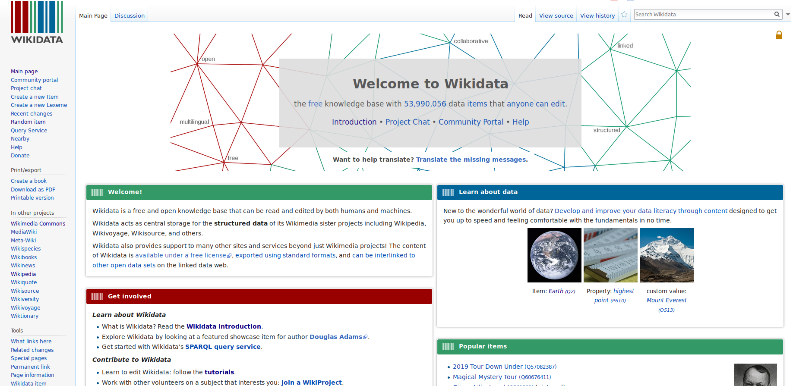

FIXME



## 1.1 Intro interface ##
- What is Wikidata?
  - Wikidatas own description says:
  "Wikidata is a free and open knowledge base that can be read and edited by both humans and machines."
  - Let's try this out in the next section of this lesson and see if we as humans can simply read the data on Wikidata:
- Explore a Wikidata Item page:
  - For this purpose go to [Wikidata Main Page](https://www.wikidata.org/wiki/Wikidata:Main_Page) by typing "www.wikidata.org" into your browser. This is what you should see:

    
  *Screenshot of [Wikidata Main Page](https://www.wikidata.org/wiki/Wikidata:Main_Page)*

  - Now go to the search bar in the top right corner and enter "british library". This will give you a list with search results. Click the entry that says: "British Library (Q23308) national library of the United Kingdom". Now you should see the british library's item page:
     https://www.wikidata.org/wiki/Q23308

  - Let us explore the item British Library (Q23308). The top part of the item page serves for identifying the item. It    has:
    - unique identifier (Q + a number)
    - label 
    - description
    - aliases
            
  - The bottom part is the "statement" section, that adds statements to the item. A statement has:
    - property (P + a number)
    - value
    - qualifier (optional)
    - references (optional)
    - is a so called triple which will be explained later
    - As you can see a property can have multiple values for one property; for example "member of"; can be further specified by qualifiers (not showen on item British Library).

- All these new definitions like statements, qualifiers and so on can be confusing. If you are not sure you can check this overview graphic https://upload.wikimedia.org/wikipedia/commons/a/ae/Datamodel_in_Wikidata.svg:

- Usually pages can be edited by anyone; click the pen on the upper-right; Q23308 - British Library is semi-protected; don't worry if you made a mistake, you can always go back in history
    - "View history" - more later
    - "Log in" and other things for registered users

- All structured data is under the creative Creative Commons CC0 License:
"The person who associated a work with this deed has dedicated the work to the public domain by waiving all of his or her rights to the work worldwide under copyright law, including all related and neighboring rights, to the extent allowed by law. You can copy, modify, distribute and perform the work, even for commercial purposes, all without asking permission."
from https://creativecommons.org/publicdomain/zero/1.0/

- Further Link describing Wikidata in one page (visual)
    - https://commons.wikimedia.org/wiki/File:Wikidata-in-brief-1.0.pdf

## 1.2 Play games to open ##

- Visit the item page of the city you were born? Does it exist? What kind of information does it show you?

## 1.3 Relationship with other wiki projects ##
- Link from Wikipedia to Wikidata
    - e.g. https://en.wikipedia.org/wiki/On_the_Origin_of_Species
        - => Follow the link "Wikidata item" on the left side under "tools"
        - => https://www.wikidata.org/wiki/Q20124
        - => the Wikipedia article is linked on the Wikidata's item page. You can find it on the right side.
        - => link to WikiCommons and WikiSource
