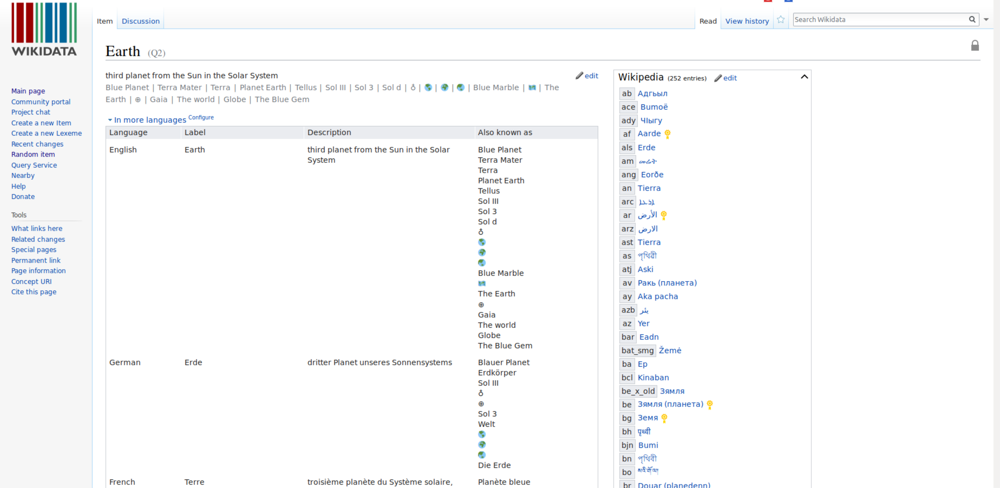

FIXME



## 1.1 Intro interface ##
- What is Wikidata?

"Wikidata is a free and open knowledge base that can be read and edited by both humans and machines."
- Let's try this out and see if we as humans can simply read the data on Wikidata:

Go to [Wikidata Main Page](https://www.wikidata.org/wiki/Wikidata:Main_Page) by typing "www.wikidata.org" into your browser. This is what you should see:

  
*Screenshot of [Wikidata Main Page](https://www.wikidata.org/wiki/Wikidata:Main_Page)*

- Earth (Q2) 
  
*Screenshot of [Wikidata World Item Page](https://www.wikidata.org/wiki/Q2)*
- Screenshot and link to page (Participants should visit the page https://www.wikidata.org/wiki/Q2)
- Description of Earth (Q2) as an example for an entry
    - Title - Earth (Q2)
    - What does "Q2"?
    - What is an item https://www.wikidata.org/wiki/Help:Items
        - Has 
            - unique identifier (Q + a number)
            - label 
            - description
            - aliases
    - "Statement" section
        - What is a statement?
            - Has
                - property (P + a number)
                - value
                - qualifier (optional)
                - references (optional)
            - is a so called triple which will be explained later
    - As you can see a property can have multiple statements for one property; for example "Population"; they are specified by "qualifiers" like point in time; an can references e.g. population at the 5 January 2016 has the reference http://www.worldometers.info/world-population/ as source.
    - Usually pages can be edited by anyonce; click the pen on the upper-right; Q2 - Earth is semi-protected (as it is very important); don't worry you made a mistake, you can always go back in history
    - "View history" - more later
    - "Log in" and other things for registered users
- CC0 
- Further Links
    - https://commons.wikimedia.org/wiki/File:Wikidata-in-brief-1.0.pdf
        
        - https://www.wikidata.org/wiki/Wikidata:Introduction#/media/File:Datamodel_in_Wikidata.svg
        - 

## 1.2 Play games to open ##

- Visit random items: https://www.wikidata.org/wiki/Special:Random
- TODO - more games needed

## 1.3 Relationship with other wiki projects ##
- Link from Wikipedia to Wikidata
    - e.g. https://en.wikipedia.org/wiki/On_the_Origin_of_Species
        - => Follow the link "Wikidata item"
        - => https://www.wikidata.org/wiki/Q20124
        - => link to WikiCommons and WikiSource
-  Link items to other wikis either added by humans or bot
