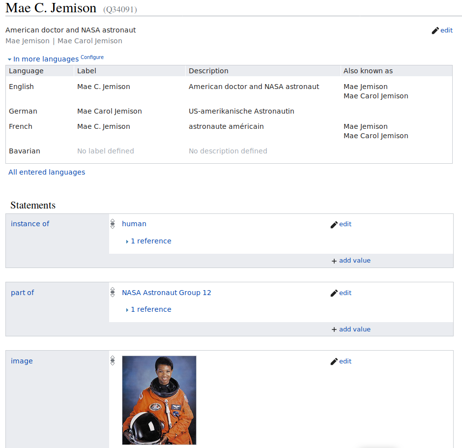

## 2.1 Concepts foundations (Semantic web  vs. relational database)
- Semantic web is an extension of the World Wide Web standards, which promote common data formats and exchange protocols on the Web, most fundamentally the Resource Description Framework (RDF) is used to store data.
- A relational database is a set of formally described related tables from which data can be accessed or reassembled.
- Most fundamentally RDF uses SPARQL (Simple Protocol and Rdf Query Language) to read stored data while relational databases uses SQL (Structured Query Language) to do so.
- In SQL relational database terms, RDF data can also be considered or viewed as a table with only three columns – the subject column, the predicate column, and the object column.

## 2.2 Concepts foundations (RDF and RDF triples)

 - The RDF is a conceptual data model, It is based on the idea of making statements about resources in expressions of the form (subject–predicate–object), known as triples.
 - The subject denotes the resource, and the predicate denotes traits or aspects of the resource, and expresses a relationship between the subject and the object, for example: John-is-a person, John-born in-1980, John-works as-Engineer
 - RDF data are stored on containers known as triplestores.

- https://en.wikipedia.org/wiki/Semantic_triple

> ## Is data stored in the RDF triple format part of your work as a librarian? 
>
> Take some time to think about if data stored in the RDF triple format 
> is part of your work as a librarian. Can you give an example in the format of an RDF triplet?  
> > ## Solution
> > *TO DO*: PLEASE ADD A REAL LIFE EXAMPLE
> {: .solution}
{: .challenge}

> ## Point out one RDF triple on the Wikidata item page of former astronaut Mae Jemison. 
>
> Got to the Wikidata page of Mae Jemison and point out one RDF triple. 
> An RDF triplet consists of a subject, a predicate and an object. 
> Can you assign the three corresponding Wikidata terms?
> 
> > ## Solution
> > Got to Wikidata and either search for "Mae Jemison" or enter the ID *Q34091*. 
> > In the picture below the statement "Mae C. Jemison - part of - NASA Astronaut Group 12" is an RDF triplet. 
> >   
> >  *Screenshot of [Wikidata Main Page](https://www.wikidata.org/wiki/Q34091)*
> >
> > On Wikidata a subject is a Wikidata item, a predicate is a Property and an object is the value of the statement.
> >
> > subject -> Item
> >
> > predicate -> Property
> >
> > object -> value
> {: .solution}
{: .challenge}

## 2.3 Wikidata one pager
- https://commons.wikimedia.org/wiki/File:Wikidata-in-brief-1.0.pdf

## 2.4 How Wikidata compares with other data sets 

- https://meta.wikimedia.org/wiki/Wikidata/Notes/DBpedia_and_Wikidata
- https://lod-cloud.net/

## DISCUSSION: ##
* There are already clashes with the previous module
* Option 1 set focus or on the usage of it for librarians
* Option 2: merge this completely into Module 1
* Option 3: Put to the end (later module)

FIXME


