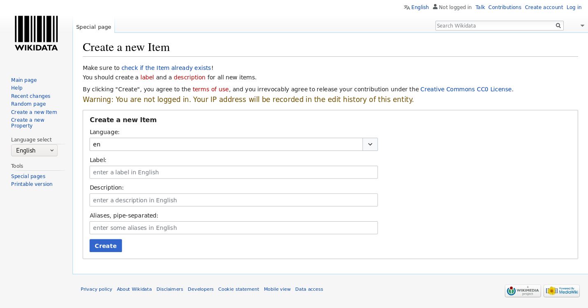



## 3.1 Introduction

Here we will work in the test instance of Wikidata so you will not break anything. Also keep in mind that the editing history is kept in Wikidata so error can also be easily fixed there. The test instance is cleaned regularly.

## 3.2 Create a new item

In the following we will create new items. In order to avoid to fill wikidata with test entries, we will used the test instance (https://test.wikidata.org/) and not the official, production version (https://wikidata.org/).

- Goto the test version at https://test.wikidata.org/
- Click "[Create a new Item](https://test.wikidata.org/wiki/Special:NewItem)" link on the left site.
- Fill the form - You can now add an entry about anything you want like a book, a research article or and author. We will generate an entry of the physisist Richard Feynman who is author of serveral important research articles but also text books and popular science books. You can also add yourself (if you feel famous enough). We choose "en" int the *Language* drop-down menue, write "Richard Feynman" in the *Label* field, "American theoretical physicist" in the *Description* field and "Richard Phillips Feynman" in the *Aliases* field.
- Once we are done we click click "Create"

  

- https://www.wikidata.org/wiki/Q39246

  
  
  

Richard Feyman wrote several books. On of it is his autobiobliography
"Surely You're Joking, Mr. Feynman!" Let's create an instance for the book

  
  
  

https://www.wikidata.org/wiki/Q2743592

## 3.3 Add statements

- Data types: 
    - String
    - Properties
    - Quantity
    - Time
    - URL
    - And many more https://www.wikidata.org/wiki/Help:Data_type

- Click add statement
- Fill a property and a values

- Some suggestions for statements:
    - "instance of" (P82) - "book", "scholarly article"
    -  "date of publication" (P151) 

Have a look again at Origin of Species to get inspiration: https://www.wikidata.org/wiki/Q20124

## 3.4 Community norms [examples of how other libraries have used?]
