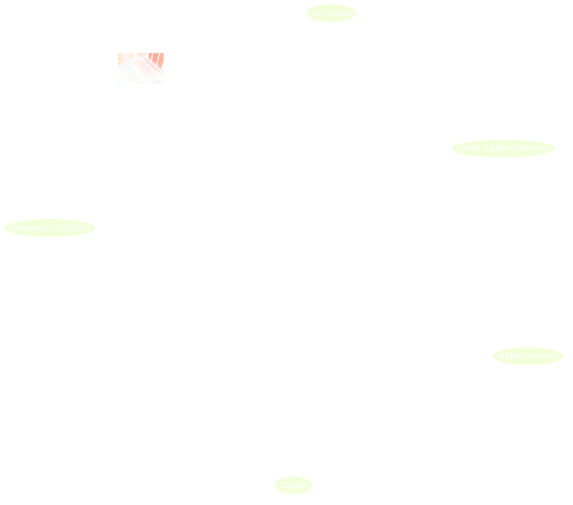
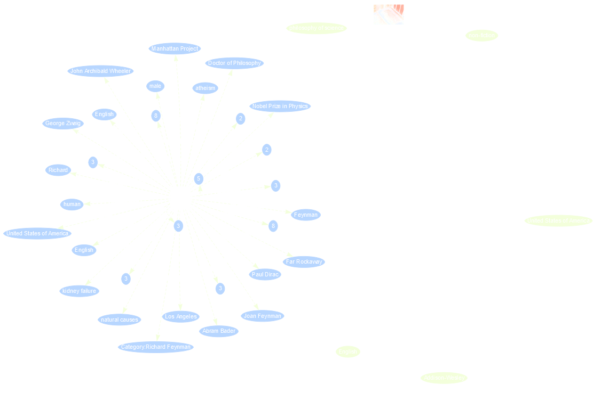

FIXME



There are different ways to query information in Wikidata. The simplest way
is to search for an entry in Wikidata and looking up all information for that entry,
e.g. [search for Richard Feynmann](https://www.wikidata.org/w/index.php?search=Richard+Feynman).
This search looks by default in the Q-pages as well as the P-pages.
However, we can restrict a search for a property by only looking in the P-pages,
e.g. if we want to look whether there is property for the ISBN we can
[restrict that search to properties only](https://www.wikidata.org/w/index.php?search=isbn&title=Special%3ASearch&profile=advanced&fulltext=1&advancedSearch-current=%7B%22namespaces%22%3A%5B120%5D%7D&ns120=1).
Moreover, for a given entry there is always the possibility to see other pages
which links to that (e.g. using it as an object), e.g. all pages linking 
to Richard Feynman: https://www.wikidata.org/wiki/Special:WhatLinksHere/Q39246

That is not much different from other searches you may be familiar with. However, the
real potential of Wikidata as a huge knowledge graph, can be experienced through
more advanced querying with the Wikidata query service where the queries have to entered
in SPARQL.

% To discover Wikidata objects nearby there is the nearby search:
% https://www.wikidata.org/wiki/Special:Nearby

## 5.1 What is SPARQL?

SPARQL is a query language for RDF data and is a W3C recommendations since 2008.
The data has to be stored as triples where the object of one triple can be
the subject of another triple. Thus, one can think about a huge knowledge graph,
where the nodes are connected by the predicates with other nodes. For example here
we see all the information about the book "The Meaning of It All" from Wikidata as
a graph:

% source: http://tinyurl.com/y267yz5q

However, this is only the graph spanned by one item and its connected entries,
which then itself also have more connections, e.g. we can open some links from
the author Richard Feynman:

% click on that node in the above query

For querying data now in this knowledge graph with SPARQL we define some graph patterns
which we want to search. The simplest form is a triple where we replace one of the
components with a variable, which is indicated by a string starting with a question mark:
- Query for the publisher: `{ wd:Q7750812 wdt:P123 ?publisher . }`
- Query for the connection: `{ wd:Q7750812 ?property wd:Q353060 . }`
- Query for the publications from Addison-Wesley: `{ ?book wdt:P123 wd:Q353060 . }`

## 5.2 Wikidata Query Service

The Wikidata query service can be found at https://query.wikidata.org/. There is the
main window on the right to formulate your query in SPARQL. On the left there is the
query helper and at the bottom the result will show up.

We will only cover here `SELECT`-statements and start by typing
~~~
SELECT * WHERE {

}
~~~
*Hint* It is enough to start typing "SELECT" and then use the auto-completion with
Ctrl+Space. % TODO what is this for on a Mac?

Inside the parenthesis you can then place the statements describing the graph pattern
you are looking for.

> ## Exercise: Your first SPARQL query
>
> Write your first SPARQL query for the publisher of the above mentioned book
> by copying the part from above point inside a SELECT-statement.
{: .challenge}

> ## Solution
>
> ~~~
> SELECT * WHERE {
>    wd:Q7750812 wdt:P123 ?publisher .
> }
> ~~~
{: .solution}

### Showing labels to Q-numbers

### Namespaces and Prefixes

% What are Prefixes?

### More conditions

- publications from Addison-Wesley vs. books from Addison-Wesley vs. books authored by Richard Feynman from Addison-Wesley
- LIMIT

### Exercises

## 5.3 Try examples (research published that week?)

## 5.4 More Advanced queries

further links

    https://commons.wikimedia.org/wiki/File:Wikidata_Query_Service_in_Brief.pdf
    https://www.uni-mannheim.de/media/Einrichtungen/dws/Files_Teaching/Semantic_Web_Technologies/SWT05-SPARQL-v1.pdf
    https://www.wikidata.org/wiki/Wikidata:SPARQL_tutorial

