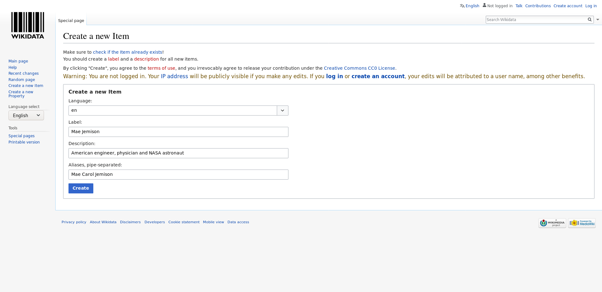
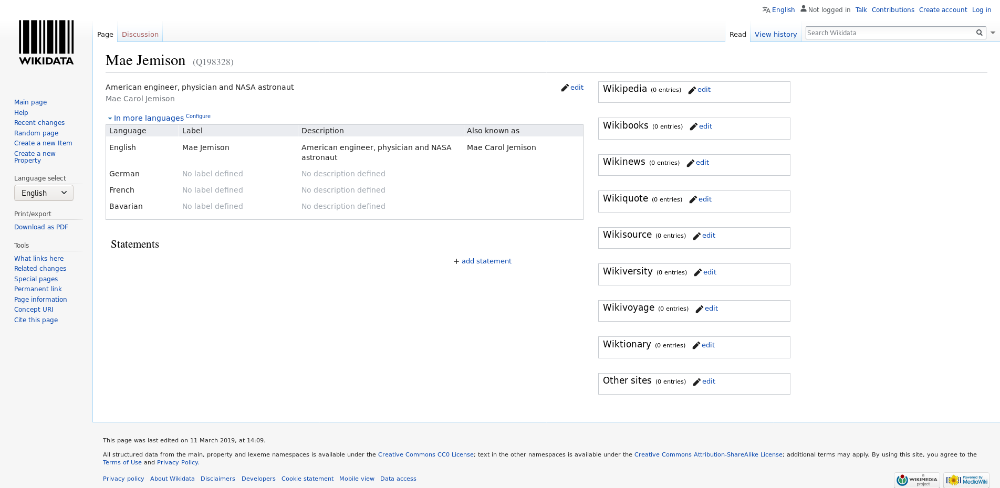
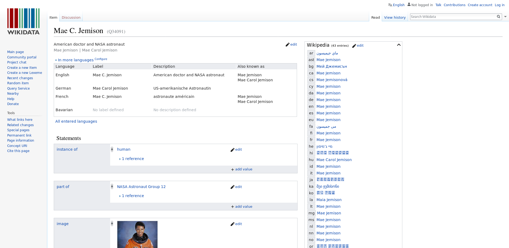

::::::::::::::::::::::::::::::::::::::: objectives

- Be able to create and edit a Wikidata entry.
- Know properties and relations, and where to find lists of approved properties and relations.
- Be able to add new statements that link to other items.
- Be aware of property constraints.
- Know community norms around Wikidata and why they are important.
- Be able to add references appropriately.
- Know what identifiers are and how to add them to a statement.
- Know different stable identifiers (e.g. ORCID for authors, DOI for works) and why makes sense to use them as properties.
- Know the correct use of properties.

::::::::::::::::::::::::::::::::::::::::::::::::::

:::::::::::::::::::::::::::::::::::::::: questions

- How to create and edit a Wikidata item?

::::::::::::::::::::::::::::::::::::::::::::::::::

## 3\.1 Introduction

Here we will work in the test instance of Wikidata so you will not break anything. Also keep in mind that the editing history is kept in Wikidata so error can also be easily fixed there. The test instance is cleaned regularly. You can quickly figure out if you are on the Wikidata instance (colored logo) or the test version (black-and-white only).

## 3\.2 Create new items

In the following we will create new items. In order to avoid to fill Wikidata with test entries, we will use the test instance ([https://test.wikidata.org/](https://test.wikidata.org/)) and not the official, production version ([https://wikidata.org/](https://wikidata.org/)).

Go to the test instance at [https://test.wikidata.org/](https://test.wikidata.org/)

Click "[Create a new Item](https://test.wikidata.org/wiki/Special:NewItem)" link on the left site. You will see a form that looks like this:

{alt='Front Page of the test instance'}

- Please fill the form. You can now add an entry about anything you want like a book, a research article or and author. We will generate an entry of [Mae Jemison](https://en.wikipedia.org/wiki/Mae_Jemison) an American engineer, physician and NASA astronaut. You can also add yourself (if you feel famous enough). We choose "en" int the *Language* drop-down menue, write "Mae Jemison" in the *Label* field, "an American engineer, physician and NASA astronaut." in the *Description* field and "Mae Carol Jemison" in the *Aliases* field.

{alt='Empty create form of the test instance'}

{alt='Empty create form of the test instance'}

- Once we are done we click click "Create". You should see you newly created article. The URL, the adress shown in your web browser, should contain "Q" and some number that is unique for this entry at the end.

{alt='Freshly created Item of Mae Jemison'}

You can compare the entry that you have generated on the test instance with the current version of the item in Wikidata ([Q34091](https://www.wikidata.org/wiki/Q34091)).

{alt='Wikidata Jemison'}

## 3\.3 Add Statements - birth reference

Why Wikidata uses references:
Like in Wikipedia it is important that content can be verified by others to make sure it is correct and comes from a reliable source of information, such as a book, scientific publication, or newspaper article.
A Reference (or source) is used to point to specific sources that back up a claim in Wikidata. A reference can be a link to a URL or an item; for example, a book. Wikidata does not aim to answer the question of whether a statement is correct, but only whether the statement appears in a reference.

Task:

- Support a statement by reference
  
  - Add the birth date (October 17, 1956) of Mae Jemison as a statement using property P569 "date of birth" to the "Mae X Jemison" item you created above.
  - Afterwards add a reference to the satement with the following url as the source: [https://www.biography.com/astronaut/mae-c-jemison](https://www.biography.com/astronaut/mae-c-jemison)

## 3\.4 Add Statements - Add ID to Mae Jemison

Task:
Support a person by it's IDs. Give the participtants the identifiers and source page for an ID and let them add it on the Mae Jemison item on the test instance of Wikidata:

- VIAF ID
  - identifier: 33699121
  - source page: [https://viaf.org/viaf/33699121/](https://viaf.org/viaf/33699121/)
- Library of Congress authority ID
  - identfier: n95004729
  - source page: [http://id.loc.gov/authorities/names/n95004729.html](https://id.loc.gov/authorities/names/n95004729.html)
- IMDb ID
  - identifier: nm0420648
  - source page: [https://www.imdb.com/name/nm0420648/](https://www.imdb.com/name/nm0420648/)
    Site note:
- ORCID is an often used ID, in this case Mae Jemison doesn't have one, but it's good to mention ORCID anyway.

## 3\.5 Norms and good practices

- Customization of languages for user interface
- Wikidata "item" vs. "article" vs. "entry"
- Policies for
  - [Labels](https://www.wikidata.org/wiki/Special:MyLanguage/Help:Label)
  - [Descriptions](https://www.wikidata.org/wiki/Special:MyLanguage/Help:Description)
- Books
  - [Data model](https://www.wikidata.org/wiki/Wikidata:WikiProject_Books)
  - [Inventaire](https://inventaire.io/welcome)

:::::::::::::::::::::::::::::::::::::::: keypoints

- create new items
- add new statements

::::::::::::::::::::::::::::::::::::::::::::::::::

