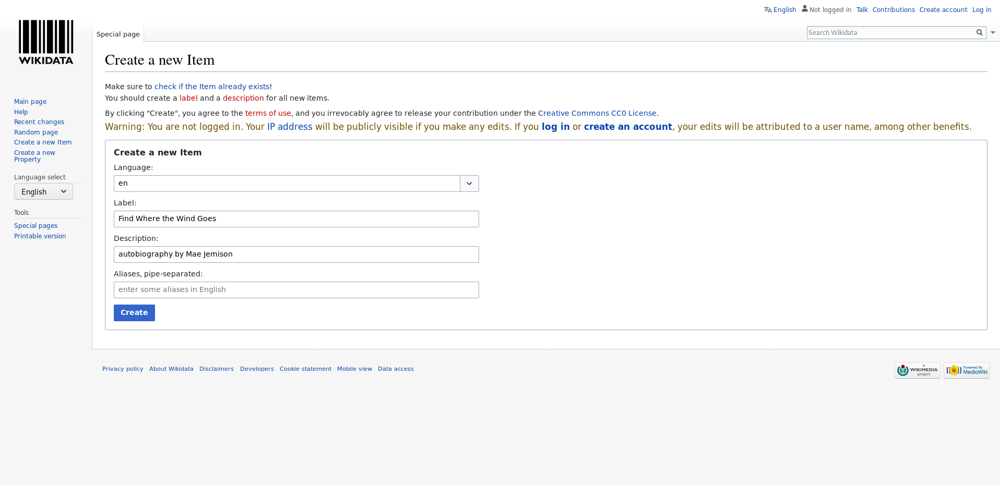
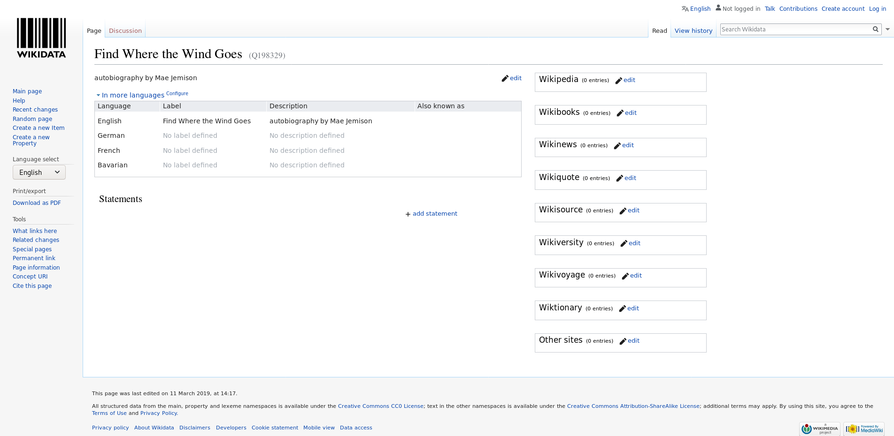
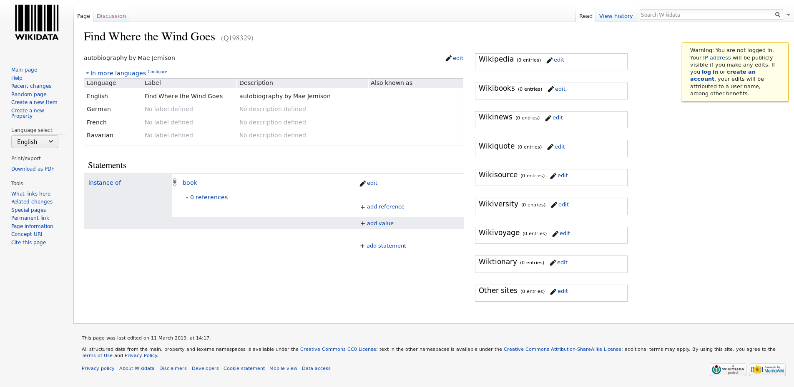
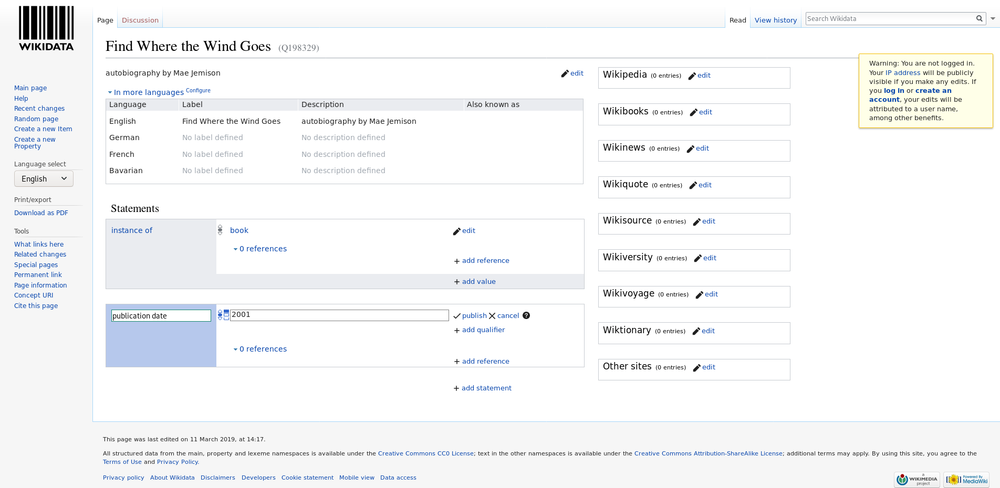
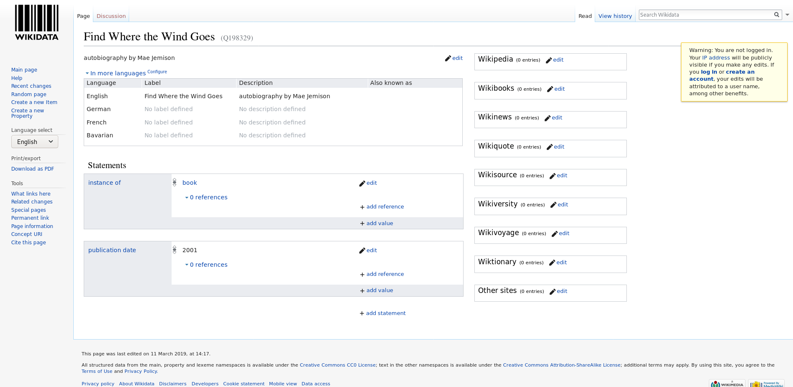
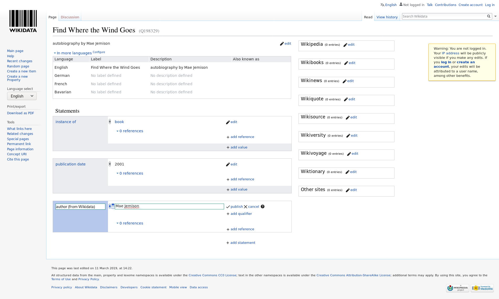
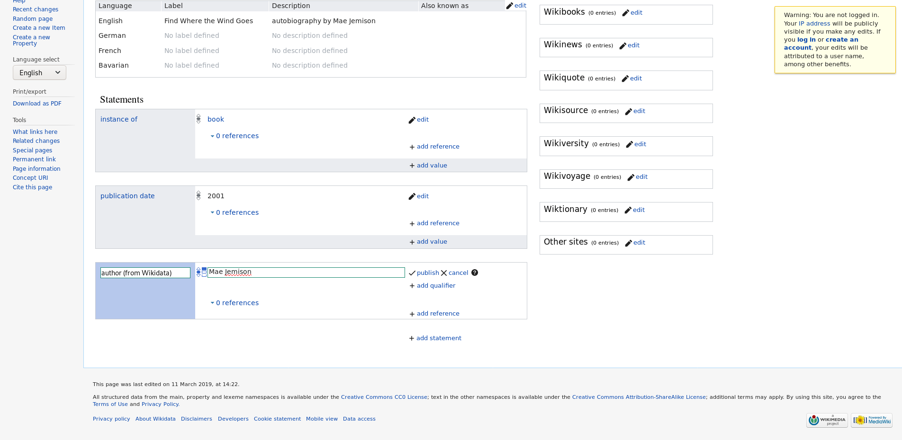
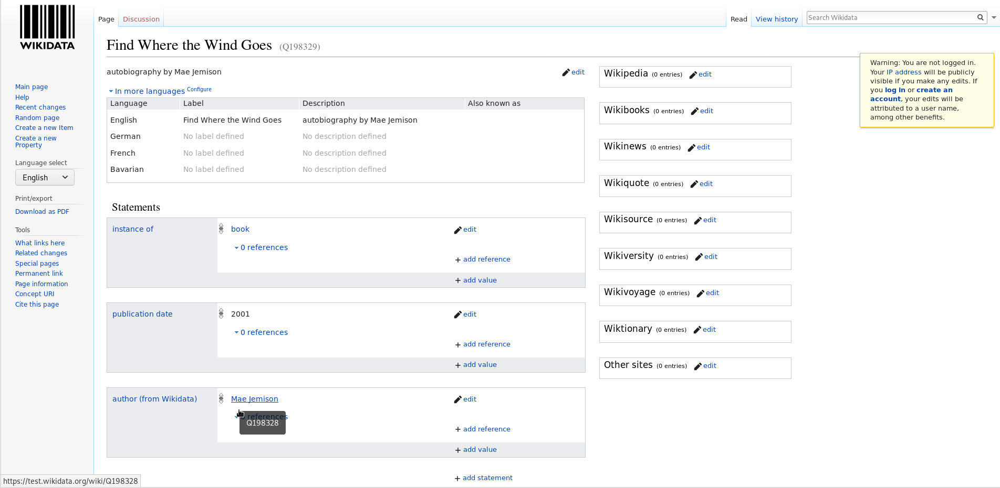



## 3.1 Introduction

Here we will work in the test instance of Wikidata so you will not break anything. Also keep in mind that the editing history is kept in Wikidata so error can also be easily fixed there. The test instance is cleaned regularly. You can quickly figure out if you are on the Wikidata instance (colored logo) or the test version (black-and-white only).

## 3.2 Create new items

In the following we will create new items. In order to avoid to fill Wikidata with test entries, we will used the test instance (https://test.wikidata.org/) and not the official, production version (https://wikidata.org/).

Goto the test instance at https://test.wikidata.org/

Click "[Create a new Item](https://test.wikidata.org/wiki/Special:NewItem)" link on the left site. You will see a form that looks like this:

  

- Please fill the form. You can now add an entry about anything you want like a book, a research article or and author. We will generate an entry of the physisist Richard Feynman who is author of serveral important research articles but also text books and popular science books. You can also add yourself (if you feel famous enough). We choose "en" int the *Language* drop-down menue, write "Richard Feynman" in the *Label* field, "American theoretical physicist" in the *Description* field and "Richard Phillips Feynman" in the *Aliases* field.

  

  

- Once we are done we click click "Create". You should see you newly created article. The URL, the adress shown in your web browser, should contain "Q" and some number that is unique for this entry at the end.

  

You can compare the entry that you have generated on the test instance with the current version of the item in Wikidata ([Q39246](https://www.wikidata.org/wiki/Q39246)).

  

That was fun - let's do this again but this time we create an entry for a book. Richard Feyman wrote several one. On of his most famous ones is is his autobiobliography "Surely You're Joking, Mr. Feynman!". We want to creat an entry for this . The procedure is the same as for the creation of the instance about Feynman himself:

- Use your web browser to go to the test instance at https://test.wikidata.org/ in case that you are not there.

  

- Click "[Create a new Item](https://test.wikidata.org/wiki/Special:NewItem)" link on the left site.

  

- Fill the form -  We choose "en" int the *Language* drop-down menue, write "Surely You're Joking, Mr. Feynman!" in the *Label* field, "book by Richard Feynman" in the *Description* field and leave the *Alias* field blank

- Once we are done we click click "Create". You should see something like his:

  

Again you can compare to version in Wikidata

https://www.wikidata.org/wiki/Q2743592

## 3.3 Add statements

Once you have created entry you can extend it by further statement. 

- Data types: 
    - String
    - Properties
    - Quantity
    - Time
    - URL
    - And many more https://www.wikidata.org/wiki/Help:Data_type

- Click on the "+ add statement" link

- Fill a property and a values

- Some suggestions for statements:
    - "instance of" (P82) - "book", "scholarly article"
    -  "date of publication" (P151) 

Have a look again at Origin of Species to get inspiration: https://www.wikidata.org/wiki/Q20124

  
  
  
  
  
  

## 3.4 Community norms [examples of how other libraries have used?]
