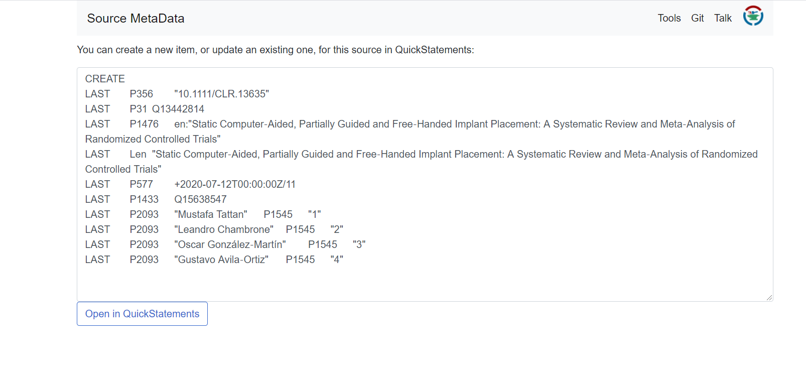

## 4.1 Adding statements via sourcemd and quickstatements

Go to [pubmed](https://pubmed.ncbi.nlm.nih.gov/), scroll down to "latest literature" and select an article. 

Save the DOI or PMID of the article

Go to (sourcemd)[https://sourcemd.toolforge.org/orcidator_old.php] and paste the DOI or PMID into the search field.

Click on "check source". Now you can see utomatically generated statements including meta data of the article like author names or date of publication. Click on "Open in QuickStatements".

A new window with QuickStatements will pop up. Now you'll get an overview of the new item and its statements. Confirm the changes by hitting the the "run" button


