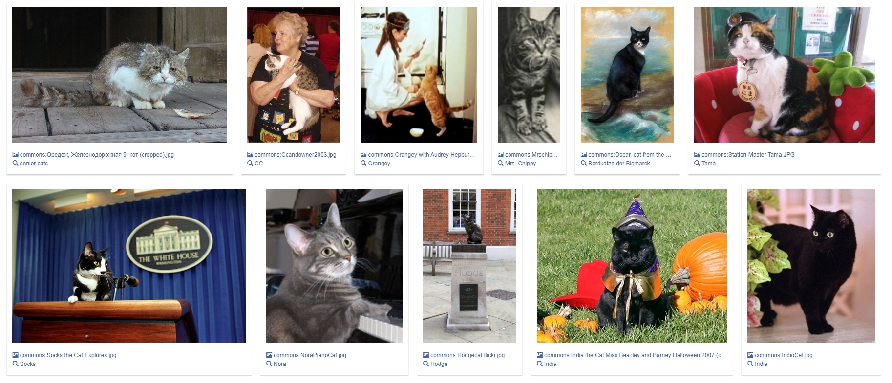
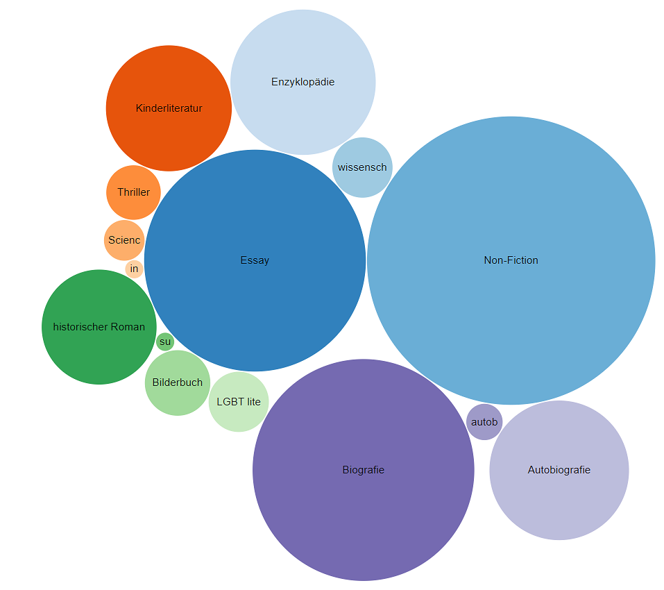
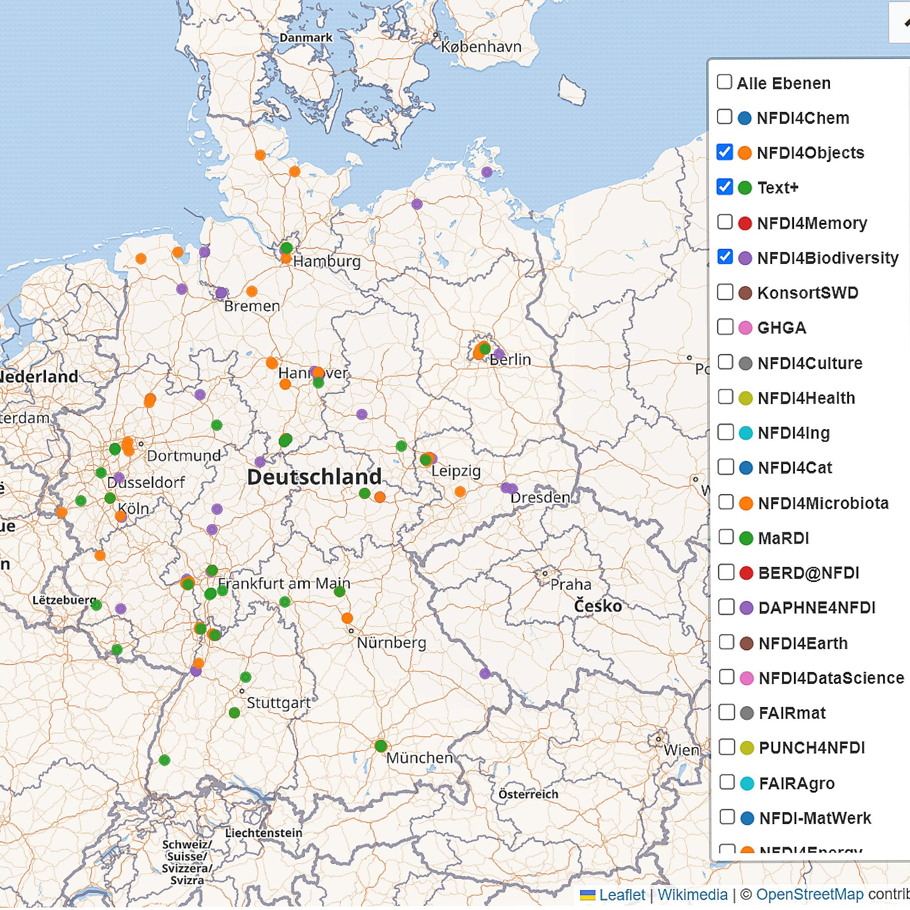
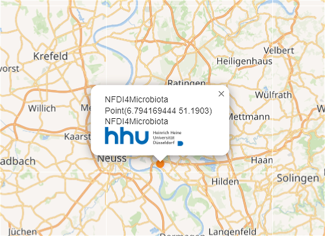
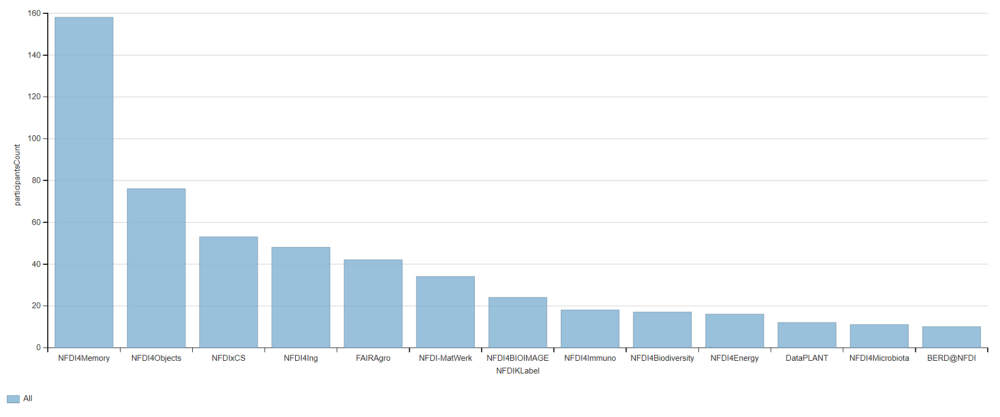
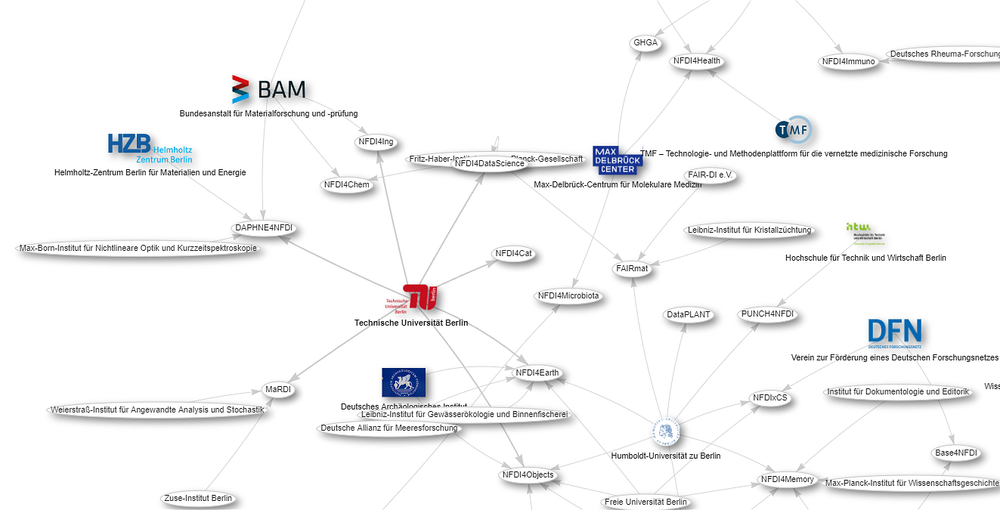

::::::::::::::::::::::::::::::::::::::: objectives

- Know what a query language is, and how SPARQL differs SQL.
- Be able to use SPARQL to query Wikidata.
- Potentially be able to use a tool like [TABernacle](https://tools.wmflabs.org/tabernacle/#/) to edit based on a query.
- Have a cursory knowledge of the plethora of Wikidata querying tools and how they can be used by librarians.
- Know the purpose and usefulness of maintenance queries for identifying missing information.
- Be able to create maintenance queries.

::::::::::::::::::::::::::::::::::::::::::::::::::

:::::::::::::::::::::::::::::::::::::::: questions

- What is SPARQL?
- How to use SPARQL to query Wikidata?
- How to use Wikidata querying tools?

::::::::::::::::::::::::::::::::::::::::::::::::::

FIXME


There are different ways to query information in Wikidata. The simplest way
is to search for an entry in Wikidata and looking up all information for that entry,
e.g. [search for Richard Feynmann](https://www.wikidata.org/w/index.php?search=Richard+Feynman).
This search looks by default in the Q-pages as well as the P-pages.
However, we can restrict a search for a property by only looking in the P-pages,
e.g. if we want to look whether there is property for the ISBN we can
[restrict that search to properties only](https://www.wikidata.org/w/index.php?search=isbn&title=Special%3ASearch&profile=advanced&fulltext=1&advancedSearch-current=%7B%22namespaces%22%3A%5B120%5D%7D&ns120=1).
Moreover, for a given entry there is always the possibility to see other pages
which links to that (e.g. using it as an object), e.g. all pages linking
to Richard Feynman: [https://www.wikidata.org/wiki/Special:WhatLinksHere/Q39246](https://www.wikidata.org/wiki/Special:WhatLinksHere/Q39246)

That is not much different from other searches you may be familiar with. However, the
real potential of Wikidata as a huge knowledge graph, can be experienced through
more advanced querying with the Wikidata query service where the queries have to entered
in SPARQL.

% To discover Wikidata objects nearby there is the nearby search:
% [https://www.wikidata.org/wiki/Special:Nearby](https://www.wikidata.org/wiki/Special:Nearby)

## 5\.1 What is SPARQL?

SPARQL is a query language for RDF data and is a W3C recommendations since 2008.
The data has to be stored as triples where the object of one triple can be
the subject of another triple. Thus, one can think about a huge knowledge graph,
where the nodes are connected by the predicates with other nodes. For example here
we see all the information about the book "The Meaning of It All" from Wikidata as
a graph:

{alt='Example for the knowledge graph spanned by one Wikidata item'}
% source: [http://tinyurl.com/y267yz5q](https://tinyurl.com/y267yz5q)

However, this is only the graph spanned by one item and its connected entries,
which then itself also have more connections, e.g. we can open some links from
the author Richard Feynman:

{alt='Example for the knowledge graph spanned by one Wikidata item and more details about Feynman'}
% click on that node in the above query

For querying data now in this knowledge graph with SPARQL we define some graph patterns
which we want to search. The simplest form is a triple where we replace one of the
components with a variable, which is indicated by a string starting with a question mark:

- Query for the publisher: `{ wd:Q7750812 wdt:P123 ?publisher . }`
- Query for the connection: `{ wd:Q7750812 ?property wd:Q353060 . }`
- Query for the publications from Addison-Wesley: `{ ?book wdt:P123 wd:Q353060 . }`

## 5\.2 Wikidata Query Service

The Wikidata query service can be found at [https://query.wikidata.org/](https://query.wikidata.org/). There is the
main window on the right to formulate your query in SPARQL. On the left there is the
query helper and at the bottom the result will show up.

We will only cover here `SELECT`\-statements and start by typing

```
SELECT * WHERE {

}
```

*Hint* It is enough to start typing "SELECT" and then use the auto-completion with
Ctrl+Space. % TODO what is this for on a Mac?

Inside the parenthesis you can then place the statements describing the graph pattern
you are looking for.

:::::::::::::::::::::::::::::::::::::::  challenge

## Exercise: Your first SPARQL query

Write your first SPARQL query for the publisher of the above mentioned book
by copying the part from above point inside a SELECT-statement.


::::::::::::::::::::::::::::::::::::::::::::::::::

:::::::::::::::  solution

## Solution

```
SELECT * WHERE {
   wd:Q7750812 wdt:P123 ?publisher .
}
```

:::::::::::::::::::::::::

### Showing labels to Q-numbers

### Namespaces and Prefixes

Prefixes are short abbrevations in the Wikidata Query Service. Some prefixes in Wikidata are: wd, wdt, p, ps, bd, etc.

Example:

```
SELECT ?item ?itemLabel 
WHERE 
{
  ?item wdt:P50 wd:Q23434.
  SERVICE wikibase:label { bd:serviceParam wikibase:language "[AUTO_LANGUAGE],en". }
}
```

Items should be prefixed with wd: and properties with wdt: .

Namespaces in Wikidata are:

- Main namespace
- Property
- Wikidata: it is for information and discussions about Wikidata itself.
  etc.

### More conditions

- publications from Addison-Wesley vs. books from Addison-Wesley vs. books authored by Richard Feynman from Addison-Wesley
- LIMIT
- ORDER
- FILTER
- OPTIONAL

### Exercises

## 5\.3 Try examples

**Cats example**

```
SELECT ?item ?itemLabel 
WHERE 
{
  ?item wdt:P31 wd:Q146. # Must be of a cat
  SERVICE wikibase:label { bd:serviceParam wikibase:language "[AUTO_LANGUAGE],en". } # Helps get the label in your language, if not, then en language
}
```
**Cats pictures**

In the first step we searched for cats. It is also possible to search for images in Wikidata if they are available. The Wikidata Query Service offers a range of visualization types. For the representation of images the image grid is suitable.


```
#defaultView:ImageGrid
#Normally, the default output is a table, but with the defaultView we can directly specify that the results should be displayed in a grid

SELECT ?item ?itemLabel ?itemPic
#Show me the item, label and the picture of it.
#The result list will look like this (wd:Q123185365/senior cats/ commons:Оредеж, Железнодорожная 9, кот (cropped).jpg)

WHERE
{
  ?item wdt:P31 wd:Q146.       #The item of this search is a cat.
  ?item wdt:P18 ?itemPic.      #Show me only cats with pictures. If you want to include very cats in your search, you need to place the Option{} function in front.

SERVICE wikibase:label { bd:serviceParam wikibase:language "[AUTO_LANGUAGE],en". }
#Helps get the label in your language, if not, then english is selected as language
}

```

{alt='Example of displaying cats in grid format'}

**Books weight by genre**
Number of available books weighted by genre.
```
#defaultView:BubbleChart
#Display the results as a Bubble Chart

SELECT ?genre ?genreLabel  (COUNT(?book) as ?bookCount)
#Show me the genre, the genre label, and count the available books as a new label ?bookCount
#The result list will look like this (wd:Q213051/Non-Fiction/252)

WHERE
{
  ?book wdt:P31 wd:Q571.            #Searched item is a book
  ?book wdt:P136 ?genre.            #Get the attribute genre form item

  SERVICE wikibase:label { bd:serviceParam wikibase:language "[AUTO_LANGUAGE],en". }
  #Helps get the label in your language, if not, then english is selected as language
}

GROUP BY ?genre ?genreLabel
#Aggregate with the group function
 
LIMIT 15
#Limit the shown results down to 15.
```

{alt='Bubblechart of books weight by genre'}


**Map of NFDI Consortia in Germany**

```
#defaultView:Map
#Display the results as a Map

SELECT DISTINCT ?affiliateLabel ?affiliatepicture ?coordinates ?NFDILabel (?NFDILabel AS ?layer)
#Show me the label, image, and coordinates of the affiliate parties.
#Show me the NFDI label as well, using the NFDILabel as a layer filter.
#The layer filter lets you choose which NFDI to display on the map.
#The result list will look like this (Deutsche Nationalbibliothek/commons:DNB.svg/NFDI4Culture/Point(8.683333333 50.131111111))

WHERE 
{
  ?NFDI wdt:P31 wd:Q98270496.       #Searched item is an accepted NFDI
  ?NFDI wdt:P1416 ?affiliate.       #Get the affiliates of the accepted NFDI.
  ?affiliate wdt:P625 ?coordinates. #Get the coordinates of the affiliate parties

  OPTIONAL { ?affiliate wdt:P17 ?country }           #Get attribute country if available
  OPTIONAL { ?affiliate wdt:P154 ?affiliatepicture } #Get attribute picture if available

  FILTER(?country = wd:Q183)        #Use Filter to set country to wd:Q183(Germany)
 

  SERVICE wikibase:label { bd:serviceParam wikibase:language "[AUTO_LANGUAGE],en" . }
  #Helps get the label in your language, if not, then english is selected as language
}
```
{alt='Map of NFDI Consortia in Germany'}


{alt='Close up look'}


**Number of participants in NFDI consortia**

```
#Number of participants in NFDI consortia
#defaultView:BarChart
#Use the bar chart as the visualization type and give me the results immediately in the form of a bar chart.

SELECT DISTINCT ?NFDIKLabel  (COUNT(DISTINCT ?participants ) as ?participantsCount)
#Give me the unique (no double entries) names of the accepted NFDIK consortia.
#Count the participants using the COUNT function and return the number of participants as a new variable ?participantsCount.   


WHERE
{
  ?NFDIK wdt:P31 wd:Q98270496.       #Give me all accepted NFDI consortia.
  ?NFDIK wdt:P710 ?participants.     #Show me the all participants of this NFDI consortium.

#Attention: Not all consortia are listed here, but only those that have an entry participants in Wikidata.
#Participants can be researchers, research institutions, universities, companies and many more.

SERVICE wikibase:label { bd:serviceParam wikibase:language "[AUTO_LANGUAGE],en" . }
#Helps to get the label in your language, if not, then english language is selected
}

GROUP BY ?NFDIKLabel
#Group by NFDIK

HAVING (?participantsCount > 4)
#Show me only NFDI consortia that have more than four registered participants.

```

{alt='Number of participants in NFDI consortia visualized as bar chart'}

**NFDI Consortia in Berlin, Germany**

```
#defaultView:Graph
#Use the graph as the visualization type


SELECT ?affiliate ?affiliateLabel ?affiliatepicture ?NFDIK ?NFDIKLabel ?NFDIKpicture
#Give me the label and the pictures of the affiliated parties of the accepted consortia of the NFDIK.
#Give me label and pictures of accepted NFDIK consortia.


WHERE
{
  ?NFDIK wdt:P31 wd:Q98270496.       #Get me all accepted NFDI consortia.
  ?NFDIK wdt:P1416 ?affiliate.       #Get the affiliates of the accepted NFDI.
  ?affiliate wdt:P131 ?location.     #Provide me with the location of the affiliated parties.

  
  FILTER(?location = wd:Q64)         #Set the location to Berlin.
  
   OPTIONAL { ?affiliate wdt:P154 ?affiliatepicture }  #Give me the pictures of the affilated partner, if available. 
   OPTIONAL { ?NFDIK wdt:P154 ?NFDIKpicture }          #Give me the pictures of the NFDI, if available.

  SERVICE wikibase:label { bd:serviceParam wikibase:language "[AUTO_LANGUAGE],en" . }
} 
#Helps to get the label in your language, if not, then english language is selected
```

{alt='the relationship between NFDI Consortia in Berlin, Germany'}

**Map of libraries**

```
SELECT distinct * WHERE {
  ?item wdt:P31/wdt:P279* wd:Q7075;
        wdt:P625 ?geo .
}
```
**scholarly articles by Alex Bateman**

```
SELECT ?item ?itemLabel ?journalLabel
WHERE 
{
  ?item wdt:P31 wd:Q13442814.
  ?item wdt:P50 wd:Q18921408.
  ?item wdt:P1433 ?journal.
  SERVICE wikibase:label { bd:serviceParam wikibase:language "[AUTO_LANGUAGE], en". }
}
```

**Russian poets**

```
SELECT ?item ?itemLabel ?place ?placeLabel ?coord
WHERE 
{
  ?item wdt:P31 wd:Q5.
  ?item wdt:P106 wd:Q49757.
  ?item wdt:P19 ?place.
  ?place wdt:P17 wd:Q159.
  ?place wdt:P625 ?coord
  
  SERVICE wikibase:label { bd:serviceParam wikibase:language "[AUTO_LANGUAGE],en". }
}
```

**chemicals example**

```
SELECT ?item ?itemLabel WHERE {
  
  ?item wdt:P31 wd:Q11173, wd:Q12140.
  
  SERVICE wikibase:label { bd:serviceParam wikibase:language "[AUTO_LANGUAGE], en". }
}
```

```
SELECT ?item ?itemLabel ?struc ?formula

WHERE {
  
  ?item wdt:P31 wd:Q11173, wd:Q12140.
  ?item wdt:P117 ?struc.
  ?item wdt:P274 ?formula
  SERVICE wikibase:label { bd:serviceParam wikibase:language "[AUTO_LANGUAGE], en". }
  
}
```

```
SELECT ?item ?itemLabel ?formula ?mass ?struc

WHERE {
  
  ?item wdt:P31 wd:Q11173, wd:Q12140.
  ?item wdt:P117 ?struc.
  ?item wdt:P274 ?formula.
  ?item wdt:P2067 ?mass.
  SERVICE wikibase:label { bd:serviceParam wikibase:language "[AUTO_LANGUAGE], en". }
  
}

ORDER BY DESC(?mass)
LIMIT 10
```

**People born in Berlin filtered by year 1970**

```
SELECT ?item ?itemLabel ?dob
WHERE 
{
  ?item wdt:P31 wd:Q5.
  ?item wdt:P19 wd:Q64.
  ?item wdt:P569 ?dob.
  
  FILTER(YEAR(?dob) = 1970)
  
  SERVICE wikibase:label { bd:serviceParam wikibase:language "[AUTO_LANGUAGE],en". }
}
```

## 5\.4 More Advanced queries

further links

```
https://commons.wikimedia.org/wiki/File:Wikidata_Query_Service_in_Brief.pdf
https://www.uni-mannheim.de/media/Einrichtungen/dws/Files_Teaching/Semantic_Web_Technologies/SWT05-SPARQL-v1.pdf
https://www.wikidata.org/wiki/Wikidata:SPARQL_tutorial
```

:::::::::::::::::::::::::::::::::::::::: keypoints

- First key point. (FIXME)

::::::::::::::::::::::::::::::::::::::::::::::::::


